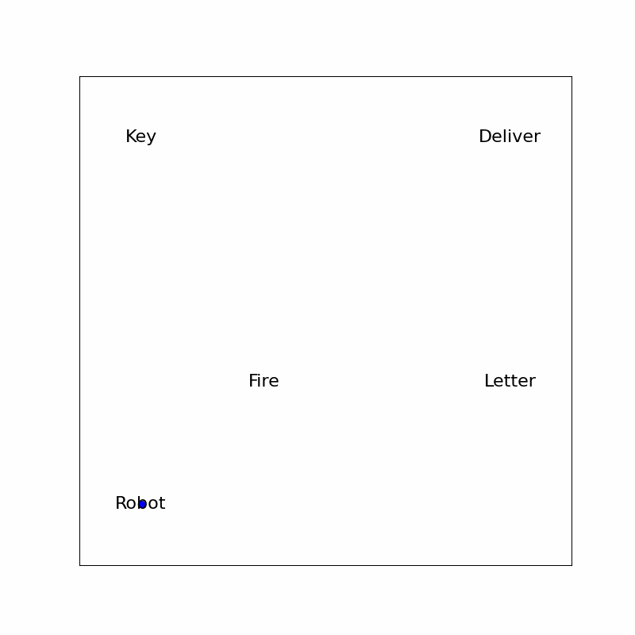
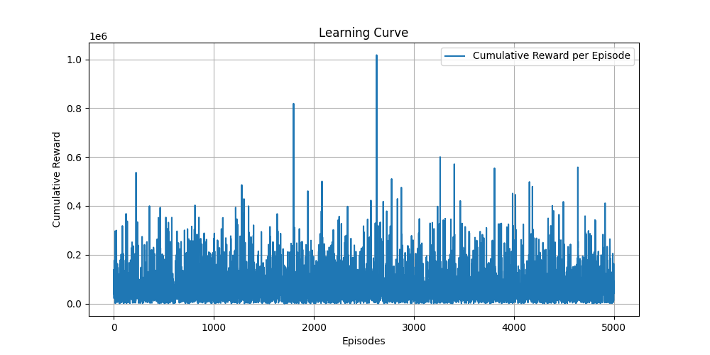

<h1 style="text-align: center;">
  Hybrid Systems Final Project (ASEN 6519 -- Hybrid Systems)
</h1>
<h2 style="text-align: center;">
  Instructor -- Morteza Lahijanian
</h2>

## Project Description:

 This project explores the application of A* and Q-learning algorithms for pathfinding in a 4x4 grid world environment constrained by Linear Temporal Logic (LTL) specifications. Phase 1 utilizes the A* algorithm to determine optimal paths that comply with LTL rules, demonstrating high efficiency and reliability in static and predictable scenarios. Phase 2 investigates the adaptability of Q-learning in the same environment, where it shows potential but requires further tuning to achieve consistent performance. Comparative analysis reveals A* as more suitable for environments requiring deterministic outcomes and minimal computational resources, whereas Q-learning offers advantages in dynamic settings where adaptability is key. This study underscores the need for advanced learning strategies in Q-learning to enhance its application in real-time autonomous navigation systems.

### LTL A_STAR Result GIF:

### LTL Q-Learning Result GIF:

### LTL Q-Learning Learning Result Curve:

